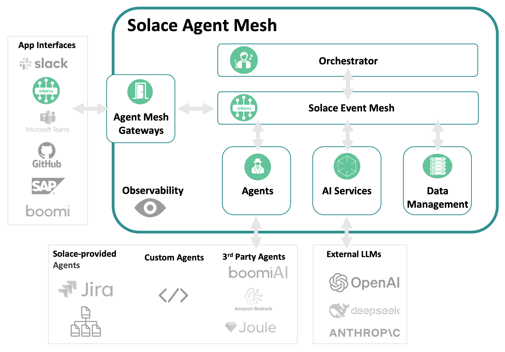

## Getting started with Solace Agent Mesh - An Agent Orchestration Framework

In this workshop, you'll gain a foundational understanding of the [Solace Agent Mesh](https://solacelabs.github.io/solace-agent-mesh/docs/documentation/getting-started/introduction/). You'll explore the architecture, key components, and benefits of the Solace Agent Mesh, learning how it enables scalable, event-driven communication between AI agents and services. The introduction covers the evolution of event-driven architectures and highlights real-world use cases where agent mesh technology can be applied.

By the end of this workshop, you'll be equipped to get started with Solace Agent Mesh, including learning the building blocks, installation prerequisites, running built-in agents, and connecting different types of agents. You'll understand how to develop custom agents, leverage plugins and tools, and build multi-agent systems that harness the power of event mesh and standardized protocols for robust, collaborative AI solutions.

